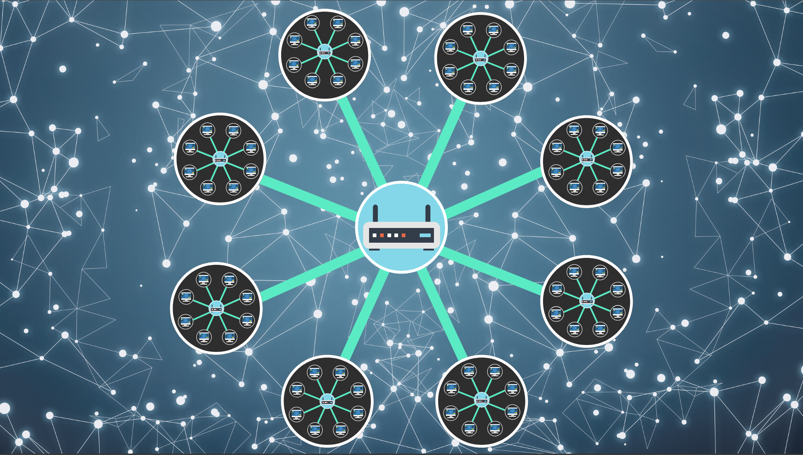
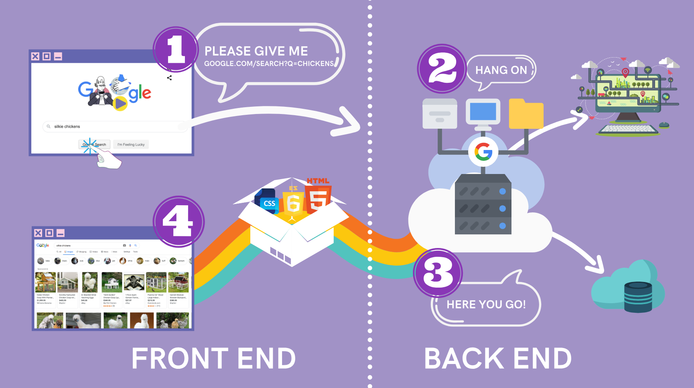

# 1. What is Internet?!

```
Internet is
Global network of interconnected computers
that communicate via TCP/IP.

Network of netnowrs.
```



```
인터넷은
방대한 인프라를 갖춘
거대한 고속도로 정도로 생각하자
```

<br><br><br>

# 2. What is Web?!

```
The World Wide Web is
an information system
where documents and others resources are available
over the internet.

Documents are transferred via HTTP.
```

<br>


```
WEB SERVER
A computer that can satisfy request on the web


CLIENT
The computer that accesses a server

서버는 클라이언트에게 지침서를 내려준다.
(IKEA에서 소파를 만들기 위한 설명서와 부품을 제공하는 것처럼)

클라이언트의 브라우저가
이 지침서를 보고 웹 페이지를 구축하여
사용자에게 보여준다.
```

<br><br><br>

# 3. What is Front-End and Back-End?!



```
백엔드는 주방에서 요리를 하는 요리사
프론트엔드는 손님에게 주문을 받고 요리를 내어주는 종업원
```

<br><br><br>

# 4. What is the role of the HTML/CSS/JS


```
보라색 공룡이 춤을 춘다에서

공룡이 HTML
공룡을 보라색으로 꾸며주는 것이 CSS
공룡을 춤을 추게 하는것이 JS
```
