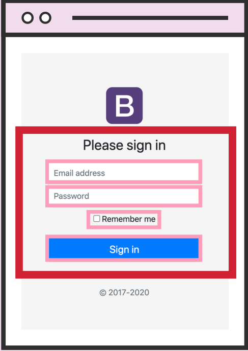

# 1. form ?!

```
- form은 사용자의 입력 내용을 그룹한 뒤에 지정된 목적지로 제출하는 역할을 수행
- action 속성에 데이터를 어디로 보낼지를 지정할 수 있다.
- method 속성에 HTTP method(GET, POST, ...)를 지정할 수 있다.
```

```html
<form action="/tacos">asfda sadfas</form>
```



<br><br><br>

# 2. Input ?!

```
- input 태그는 사용자의 다양한 입력을 받기 위한 태그이다.
- type 속성에 값을 넣어서 원하는 형태의 input을 만들 수 있다.
```

```html
<form action="/tacos">
    <input type="text" placeholder="username" />
    <input type="password" placeholder="passwords" />
    <input type="color" />
    <input type="number" placeholder="enter a number" />
</form>
```

<br><br><br>

# 3. Label ?!

```
- label은 사용자에게 input의 역할을 설명해준다.
- label을 클릭하면 연결된 input으로 커서가 이동하게 된다.
- label은 input과 1대1로 연결되어있다.
- label과 input을 연결하려면 label의 for 속성에 input의 id를 넣으면 된다.
```

```html
<form action="/tacos">
    <p>
        <label for="username">Enter a Username:</label>
        <input id="username" type="text" placeholder="username" />
    </p>
    <p>
        <label for="password">Enter a Password:</label>
        <input id="password" type="password" placeholder="passwords" />
    </p>
    <p>
        <label for="color">Enter a Color:</label>
        <input id="color" type="color" />
    </p>
    <p>
        <label for="number">Enter a Number:</label>
        <input id="number" type="number" placeholder="enter a number" />
    </p>
</form>
```

<br><br><br>

<br><br><br>

# 4. Button ?!

```
- form 태그 안에 button이 들어있는 경우 그 버튼을 누르면 해당 form이 제출된다.
- form 태그 안에 있는 button에 type="button"을 지정하면 form 제출 기능이 없어진다.
- form 태그 안에 있는 button에 type="submit"을 지정하면 해당 버튼은 form 제출 기능을 하게 된다.
```

```html
<form action="/tacos">
    <p>
        <label for="username">Enter a Username:</label>
        <input id="username" type="text" placeholder="username" />
    </p>
    <!-- this button doesn't submit the form b/c of the "type" attribute -->
    <button type="button">Regular button (won't submit)</button>
    <!-- this button submits the form! -->
    <button type="submit">Submit</button>
    <!-- so does this one -->
    <input type="submit" value="Click Me!" />
</form>
```

<br><br><br>

<br><br><br>

# 4. input name attribute ?!

```
- form이 제출될 때 사용자가 입력한 값은 key, value 형태로 서버에 전달된다.
- 이 때, input의 name 속성을 통해서 해당 input의 key를 지정할 수 있다.
```

```html
<h2>Hijacking Searches</h2>

<h3>Search Reddit</h3>
<form action="https://www.reddit.com/search">
    <input type="text" name="q" id="" />
    <button>Search Reddit</button>
</form>

<h3>Search Google</h3>
<form action="https://www.google.com/search">
    <input type="text" name="q" id="" />
    <button>Search Google</button>
</form>

<h3>Search Youtube</h3>
<form action="https://www.youtube.com/results">
    <input type="text" name="search_query" id="" />
    <button>Search Youtube</button>
</form>
```

<br><br><br>
