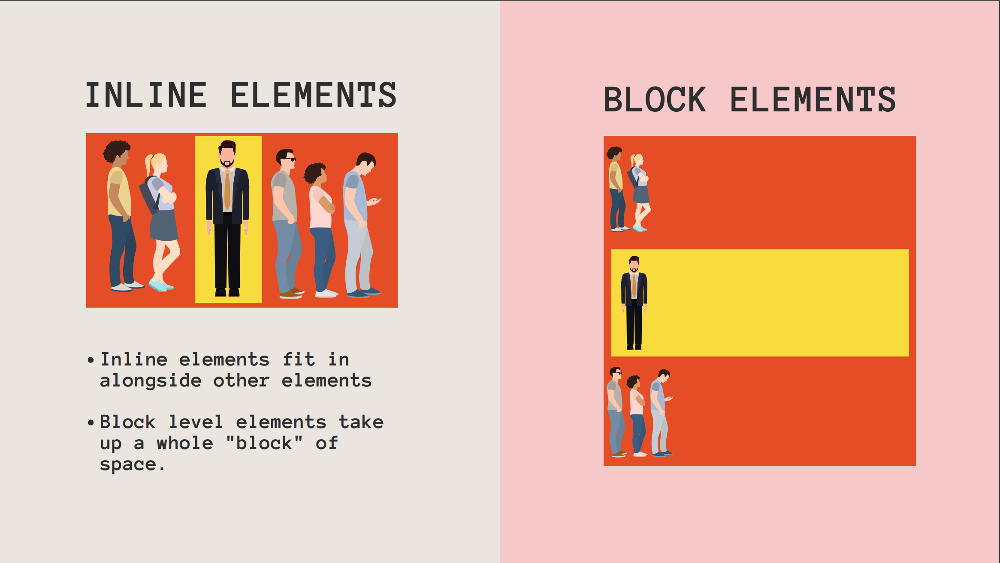

# 1. HTML5란?!

```
가장 최근의 HTML 표준
비디오나 오디오 등 최신기능 사용가능
```

<br><br><br>

# 2. inline vs block



```
inline은 다른 element의 바로 옆에 위치
(최소한의 공간 차지)
예) span 태그

block는 다른 element의 다음 줄에 위치
(한 줄 통째로 차지)
예) div 태그
```

<br><br><br>

# 3. 기타 태그 (HR, BR, Sup, Sub)

```html
<!-- hr 태그는 가로선을 하나 만들 때 사용 -->
<hr />

<!-- br 태그는 줄을 바꿀 때 사용 -->
<p>
    To see a World in a Grain of Sand <br />
    And a Heaven in a Wild Flower <br />
    Hold Infinity in the palm of your hand <br />
    And Eternity in an hour <br />
    A Robin Red breast in a Cage <br />
</p>

<!-- sup 태그는 윗첨자, sub 태그는 아랫첨자 -->
<p>
    any other bird or domesticated fowl.<sup
        ><a href="somesource.com">[2]</a></sup
    >
    Humans keep chickens
</p>

<h2>I like H<sub>2</sub>O</h2>

<p><sup>1</sup>/<sub>2</sub> + <sup>1</sup>/<sub>2</sub> = 1</p>
```

<br><br><br>

# 4. HTML entities

[엔터티코드](https://html.spec.whatwg.org/multipage/named-characters.html)

```
html entities?!
- html 문서에서 특수한 문자를 쓰고 싶을 때 사용한다.
- <, >, & 등등
- '&'로 시작해서 ';'로 끝난다.
```

```html
<!-- 1 < 6 < 9  -->
<h1>1 &lt; 6 &gt; 9</h1>
```

<br><br><br>

# 5. 시멘틱 마크업

```
무지성으로 div만 사용하면
div가 대체 무슨 역할을 하는지
직관적으로 알기 어렵다.

그래서
header, footer, nav, main, section
등의 태그를 사용해서
해당 element가 어떤 역할을 하는지
명시할 수 있다.

시멘틱 마크업은 마크업에 의미를 부여하는 것

마크업이 의미를 가지게 되면
- 크롤링 프로그램이 정보를 찾을 때 유리
- 스크린리더 프로그램이 정보를 찾을 때 유리
- 개발자가 웹페이지의 구조를 찾을 때 유리
등의 장점이 있다.

※ 스크린리더는 시각장애인 등을 위해서
화면을 소리내어 읽어주는 프로그램
```

```html
<!-- main : 문서의 주요 내용 -->

<!-- nav : 내비게이션 링크를 제공  -->
<nav>
    <ul>
        <li><a href="home">Home</a></li>
        <li><a href="about.html">About</a></li>
        <li><a href="contact">Contact</a></li>
    </ul>
</nav>

<!-- section : 웹페이지의 독립적인 부분 -->

<!-- artice : 독립적으로 재사용될 수 있는 부분 예) 날씨 위젯 -->

<!-- aside : 사이드바 -->
```
